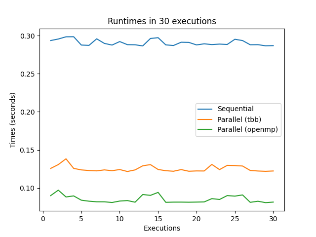

# Trabalho Proposto Durante as Aulas de Sistemas Operacionais Para Implementação e Comparação Entre Desempenhos de Abordagens Sequenciaias e Paralelas. 

## Tecnologias Utilizadas:
[C++]
[Python]

## Bibliotecas Utilizadas:
### Em C++:
[iostream]
[vector]
[chrono]
[math.h]
[omp.h]
[tbb/tbb.h]
[fstream]

### Em Python:
[re]
[pandas]
[tabulate]
[matplotlib.pyplot]
[numpy]

## Como funciona os algoritmos
Primeiramente é utilizado o comando `g++ -o exec competition.cpp -fopenmp -ltbb` para compilar o algoritmo, depois 'no termial do Linux Ubuntu' ao executa-lo pode ser passado 1 argumento, dessa forma: `./exec 7`, se for passado, esse será o valor utilizado como expoente de 10, sendo o resultado o tamanho do vetor utilizado para fazer a soma dos valores, se não, o algoritmo usa por padrão 8.

Durante a execução do algoritmo `competition.cpp` são utilizados tecnicas para medir o tempo de cada abordagem, depois são armazenados 30 tempos de execuções dentro de um vetor para cada abordagem e calculados as médias e desvio padrão dessas 30 execuções, por fim é ultilizado a biblioteca `fstream` para inserir dentro de um arquivo aberto todas impressões feitas na tela do terminal.

Após isso, pode então ser executado o algoritmo `runtimes_graphic.py` que utilizara o arquivo `competition_output.txt` gerado na pasta `/output` para extrair os tempos de execuções, e posteriormente serem usados para plotar o gráfico, com os dados extraídos o algoritmo gera uma tabela com esses dados, mostra na tela e também salva no arquivo `runtimes_table.txt` dentro da pasta `/output` a tabela gerada, por fim, é gerado os gráficos com os dados extraídos, salvo na pasta `/output` como `runtimes_graphic.png` e mostrado na tela o gráfico.

## Introdução ao Problema e Objetivo do Exercício

A princípio uma soma comum de vetores parece uma tarefa simples de se fazer, o que realmente é verdade, porém quando partimos para algoritmos mais complexos e sofisticados, essa não é uma tarefa muito fácil, principalmente se forem feitas de forma sequencial. Algoritmos complexos como de multiplicação de matrizes, algoritmos de ordenação e algoritmos de busca por exemplo, são algoritmos que foram construídos com base na soma de vetores, por isso é fundamental entender quais são as melhores abordagens para otimizar esse processos.

O objetivo principal deste trabalho é avaliar o desempenho de diferentes abordagens para a soma de elementos de um vetor, comparando a execução sequencial com implementações paralelas utilizando as bibliotecas OpenMP e TBB, incluindo também o cálculo de média e desvio padrão dos tempos de execução e a criação de gráficos para a visualização dos dados, podendo assim avaliar melhor cada implementação ao longo de várias execuções.

## Descrição da Metodologia

### Medição dos Tempos

Para medir o tempo de execução de cada abordagem, foi utilizado o cronômetro de alta resolução da biblioteca C++ `chrono`. Que funciona da seguinte forma:

Primeiro é armazenado o tempo de início numa varável start:

```cpp
// Gravando o tempo no inicio da soma
auto start = chrono::high_resolution_clock::now();
```

Depois é armazenado o tempo final numa varável end:

```cpp
// Marcando o tempo no final da da soma
auto end = chrono::high_resolution_clock::now();
```

E por fim é feito subtração dos dois tempos para saber o intervalo de tempo, esse sendo o tempo de duração:

```cpp
// Armazenando na váriavel duration do tipo double, definido dentro da classe duration
chrono::duration<double> duration = end - start;
```

### Passos para a Paralelização

**OpenMP:**

A diretiva `#pragma omp parallel for reduction(+:sum)` foi utilizada para paralelizar o loop de soma. A cláusula `reduction(+:sum)` garante que a soma parcial de cada thread seja corretamente combinada ao final da execução paralela.

```cpp
// Definindo que o próximo for será executada de forma paralela e que o soma será compartilhada entre as threads e que as atualizações nessa váriavel será feita usando a operação soma.
#pragma omp parallel for reduction(+:sum)
```

**TBB:**

A biblioteca TBB (Threading Building Blocks) oferece um modelo de programação mais flexível.

Foi utilizada a função `parallel_for` para dividir o intervalo de índices do vetor em subintervalos, cada um sendo processado por uma thread. A soma parcial de cada thread foi armazenada em um vetor e, posteriormente, foi somado também cada valor do vetor soma parcial para obter o resultado final.

```cpp
// Definindo o intervalo de índices em que as threads vão trabalhar
blocked_range<int> range(0, LENGTH);

// Função anônima lambda que define o bloco de execução que será executada de forma paralela pelas threads posteriormente
auto h = [&](const blocked_range<int>r) {
    int sum = 0;
    // Atribuindo o índice da thread da tarefa atual ao tid
    int tid = this_task_arena::current_thread_index();

    // Somando o intervalo valores do array que a thread ficou responsável
    for (int i = r.begin(); i < r.end(); ++i) sum += array[i];

    // Somando a soma feita pela thread atual, ao valor do índice tid da variável soma parcial
    partial_sums[tid] += sum;
};

parallel_for(range, h);
```

A função lambda acima, é uma função anônima que define o bloco a ser executado pelas threads, ela é passada como argumento da função `parallel_for`, juntamento com o range de índices a serem divididos. Onde realmente ocorre a execução de forma paralela.

## Resultados

Depois de serem medidos todos os tempos de execuções é feito a média e o desvio padrão para cada uma das abordagens, usando funções simples para isso.

Função que calcula a média:

```cpp
// Função que calcula a média de um determinado vetor
float calc_average(vector<float> vector, const int LENGTH){
    float sum = 0;
    for(int i = 0; i < LENGTH; i++){
        sum += vector[i];

    }
    return (sum / LENGTH);
}

```

Função que calcula o desvio padrão:

```cpp
// Função que calcula o desvio padrão de um determinado vetor, com base na média
float calc_std_deviation(vector<float> vector, const int LENGTH){
    float std_devtion = 0;
    float avg = calc_average(vector, LENGTH);

    // Somando cada potência quadrada da diferença entre o valor e a média
    for(int i = 0; i < LENGTH; i++) std_devtion += pow((vector[i] - avg), 2);

    // Retornando o desvio padrão, sendo esse a divisão entre, a somatória dos
    // quadrados da diferença entre cada valor e a média e o tamanho
    // da amostra menos 1
    return sqrt((std_devtion / (LENGTH - 1)));

```

Após esse calculo percebe-se uma vantagem entre os tempos de execuções com abordagem paralela sobre a sequencial.

### Média e Desvio Padrão dos Tempos

| **Abordagem** | **Média (s)** | **Desvio Padrão (s)** |
| --- | --- | --- |
| Sequencial | 0.290671 | 0.00389665 |
| Paralelo (OpenMP) | 0.085152 | 0.00465221 |
| Paralelo (TBB) | 0.12522 | 0.00394169 |

### Gráfico da 30 execuções para cada abordagem



## Discussão dos Resultados

As implementações paralelas utilizando OpenMP e TBB apresentaram tempos de execução significativamente menores em comparação com a implementação sequencial. Isso demonstra o benefício da paralelização para a operação de soma de vetores.

Os tempos de execução variam ligeiramente entre as diferentes execuções, mesmo para a mesma abordagem. Essa variação pode ser por causa de diversos fatores como, a concorrência de outros processos e a alocação de recursos pelo sistema operacional. Pode-se perceber que ouve um menor variação dos tempos de execução para a abordagem sequencial, mesmo que pequena, quando comparada a paralela usando a Threading Building Blocks.

Esses resultados obtidos demonstra a maior eficácia da paralelização para operação de soma com vetores contra fazer isso de forma sequencial, concluindo então a importância de usar a paralelização em problemas de larga escala, já que isso pode ser um ganho suficientemente grande em relação ao outro tipo de abordagem.
